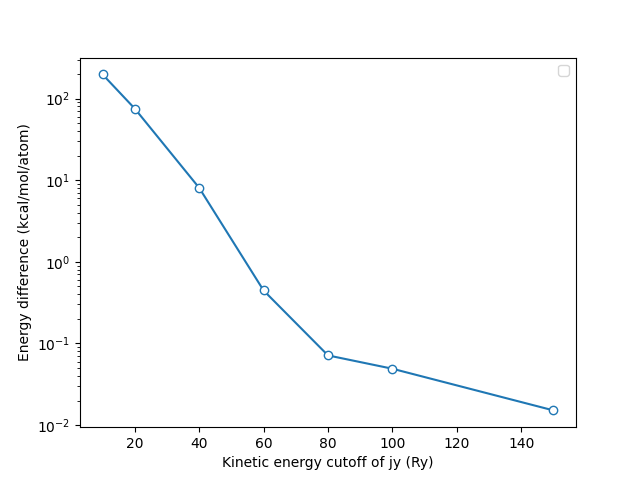
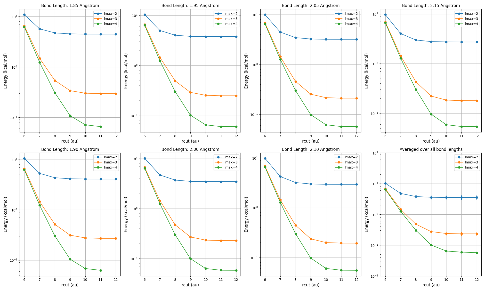

# Orbgen tools

This directory contains tools for generating the ABACUS orbitals. There are several hyperparameters that should be determined before a series of practical orbital generation:

1. `ecutgrid`: the pseudopotential convergence. The pseudopotential may requires a large number of plane waves/a fine realspace grid to converge. Make sure the value used for `ecutwfc` parameter of ABACUS is large enough.
2. `ecutjy`: the kinetic energy cutoff of spherical Bessel functions. The spherical Bessel functions are used to expand the exact atomic orbitals, the more Bessel functions are used, the more exact the radial function generated will be. However, large set of Bessel functions will increase the computational cost. It has been observed that the total energy convergence of single atom system is not a good indicator of the convergence of the number of radial functions, main reasons are two:
    - the total energy only relies on the ground state or occupied state. However, an orbital generation task sometimes requires the unoccupied orbital to initialize the contraction coefficients.
    - for the simplest dimer system, when the distance between two atoms is very small, the requirement of the number of radial functions is much higher than the single atom system, that is to say, this is the case that the total energy is not a good indicator of the number of radial functions.
3. `lmax` and `rcut`: the maximal angular momentum included and the cutoff radius of radial functions. Some reasons are chemical, some are mathematical. Make sure the values used for `lmax` and `rcut` parameter are enough for striking a balance between accuracy and efficiency. The accuracy should be benchmarked by a PW calculation.

## Tools

### JYEkinConvTest*

This tool is used to test the convergence of the kinetic energy cutoff of spherical Bessel functions. It generates the radial functions of a single atom system and calculates the total energy of the system. The total energy is used to determine the convergence of the kinetic energy cutoff of spherical Bessel functions. The total energy is not a good indicator of the convergence of the number of radial functions, but it is a good indicator of the convergence of the kinetic energy cutoff of spherical Bessel functions.

You need follow the following steps to perform tests. The test on `lmax` and `rcut` is quite similar.

1. open the `JYEkinConvTestGenerator.py`, adjust proper parameter for it and run it simply with

    ```bash
    python JYEkinConvTestGenerator.py
    ```

    to generate testfiles.
2. open the `abacustest.py` and adjust parameters, then submit to the DPTechnology Bohrium Supercomputing Platform with

    ```bash
    python abacustest.py
    ```

    to perform tests. NOTE: the `abacustest.py` requires a proper installation and configuration of `lbg` and `abacus-test` packages. You can install `lbg` very simply by

    ```bash
    pip install lbg -U
    ```

    and you can install `abacus-test` by

    ```bash
    git clone https://github.com/pxlxingliang/abacus-test.git
    cd abacus-test
    python3 setup.py install
    ```

3. after the tests are done, `abacus-test` will automatically download the calculation result. You can use the `JYEkinConvTestReader.py` to read the results and plot the convergence of the kinetic energy cutoff of spherical Bessel functions.

    ```bash
    python JYEkinConvTestReader.py
    ```

    The plot will be saved as `JYEkinConvTest.png`, like the following:

    

    From the figure above, you can see that once you want an orbital with the upper bound of accuracy with respect to the PW as 1 kcal/mol (the so-called chemical-accuracy), you should at least use `ecutjy=60` for the orbital generation.

### JYLmaxRcutJointConvTest*

This tool is used to test the convergence of the maximal angular momentum and the cutoff radius of radial functions. It generates the radial functions of a single atom system and calculates the total energy of the system. The total energy is used to determine the convergence of the maximal angular momentum and the cutoff radius of radial functions. The total energy is not a good indicator of the convergence of the number of radial functions, but it is a good indicator of the convergence of the maximal angular momentum and the cutoff radius of radial functions.

You can follow the similar steps as the `JYEkinConvTest` to perform tests, and you can use the `JYLmaxRcutJointConvTestReader.py` to read the results and plot the convergence of the maximal angular momentum and the cutoff radius of radial functions. The plot will be saved as `JYLmaxRcutJointConvTest.png`, like the following:



From the figure above, you can see that once you want an orbital with the upper bound of accuracy with respect to the PW as 1 kcal/mol (the so-called chemical-accuracy), you should at least use `lmax=3` and `rcut=8` for the orbital generation.
